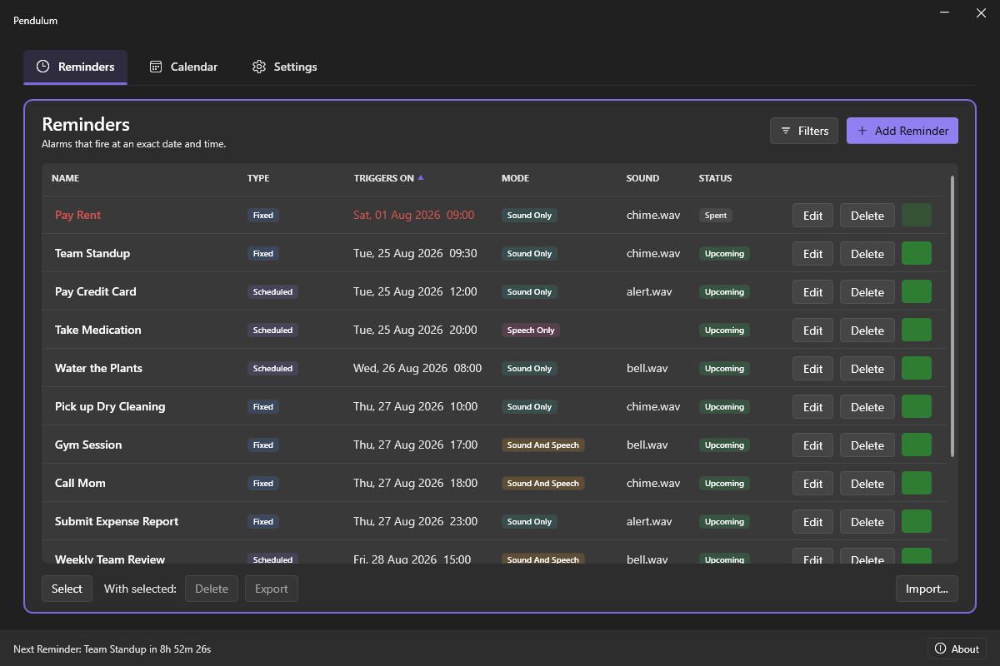
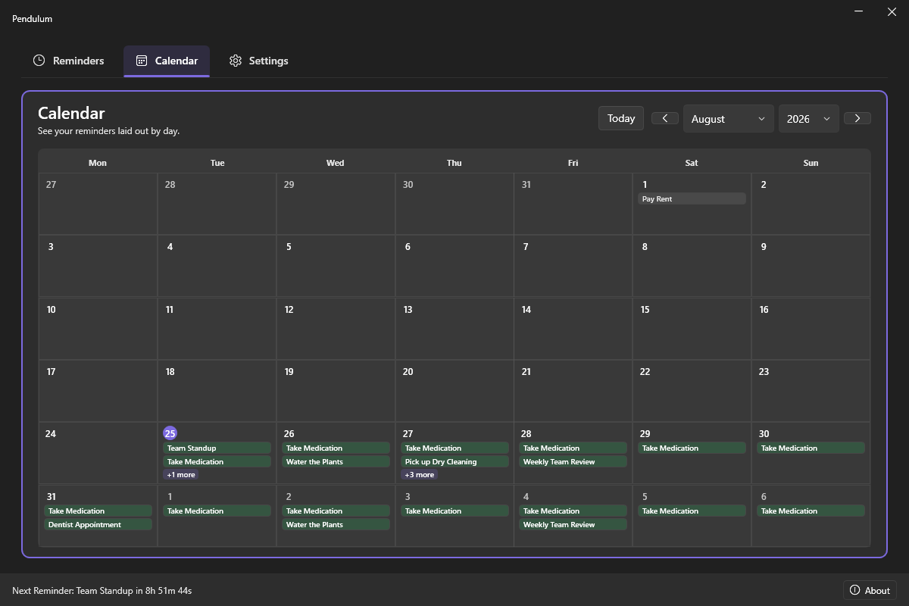
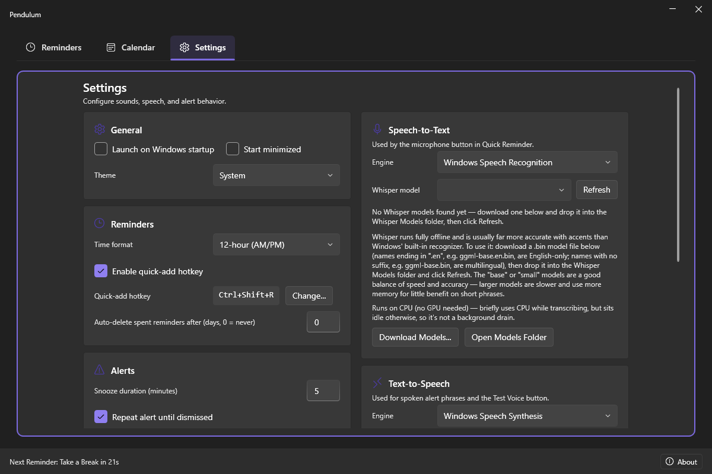
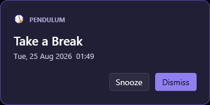

# Pendulum

A tray-resident Windows desktop timer and alarm utility. Pendulum stays out of the way in the system tray and surfaces alerts as a topmost popup with sound and/or spoken-phrase notifications, even while you're working in another window.

<p align="center">
  
  
  
  
</p>

## Features

- **Reminders** — alarms set for an exact date and time, with sound, text-to-speech, or both. Supports Outlook-style recurrence (daily/weekly/monthly/yearly), bulk select/delete/export, and reminders-only or whole-app backup & restore.
- **Calendar** — a month view of every reminder, with navigable months/years and click-to-edit on any reminder shown on it.
- **Settings** — sound library management, speech-to-text (Windows or a locally-run Whisper model) for the Quick Reminder mic button, text-to-speech (Windows or a locally-run Piper voice), alert style, snooze duration, an auto-resolve timeout for unanswered alerts, 12/24-hour time format, and launch-on-startup.
- **Tray integration** — minimizes to the system tray instead of closing; the tray icon's tooltip shows the next upcoming reminder.
- **Resilient by design** — reminders that come due while the app is closed, or that go unanswered, resolve themselves sensibly (reschedule if recurring, mark spent otherwise) instead of getting stuck.

## Getting Pendulum

Download the latest `PendulumSetup-<version>.exe` from the [Releases](https://github.com/Suremise/Pendulum/releases) page — self-contained (no separate .NET install required), installs per-user (no admin/UAC prompt), adds a Start Menu entry and optional desktop shortcut, and registers a normal uninstaller. See [CHANGELOG.md](CHANGELOG.md) for what's new in each version.

## Building from source

Requires the [.NET 8 SDK](https://dotnet.microsoft.com/download).

```
dotnet build Pendulum.sln -c Release
```

Produces a self-contained win-x64 build at `Pendulum.App\bin\Release\net8.0-windows\win-x64\`. This is the fast day-to-day dev loop — use `-c Debug` while iterating.

To cut a distributable release:

```
.\build-installer.ps1    # -> installer\Output\PendulumSetup-<version>.exe (requires Inno Setup 6)
```

## Project structure

- **Pendulum.App** — WPF UI (WPF-UI Fluent design), MVVM via CommunityToolkit.Mvvm, tray icon via H.NotifyIcon.
- **Pendulum.Core** — models, the timer engine, recurrence calculation, audio (NAudio) and speech (System.Speech/SAPI5) services, and JSON persistence. No UI dependencies.

## Data model

The installer places everything under `%LocalAppData%\Programs\Pendulum` (no admin/UAC
prompt needed, unlike a `Program Files` install) — but the important part isn't *where*
that is, it's that the exe and its data aren't split apart. There's no separate roaming
profile data folder and no registry use beyond the one opt-in "Launch on Windows startup"
toggle (a single `Run` key); the app's data always lives right next to whichever copy of
the exe is running it, dev build or installed:

```
Pendulum.exe
Data\
  settings.json
  triggers.json
  WhisperModels\   (Whisper ggml models, downloaded separately — see Settings)
  PiperModels\     (Piper engine + voice models, downloaded separately — see Settings)
Sounds\
  chime.wav, bell.wav, ...
```

## License

Pendulum is released under the [MIT License](LICENSE).

## Third-party software

Built on several open-source libraries, and optionally on the separately-downloaded
Whisper and Piper speech engines — see [THIRD-PARTY-NOTICES.md](THIRD-PARTY-NOTICES.md)
for the full list and licenses (all MIT).

---

**Surmise** — **Sure**mised it right. — [surmise.it](https://surmise.it)
